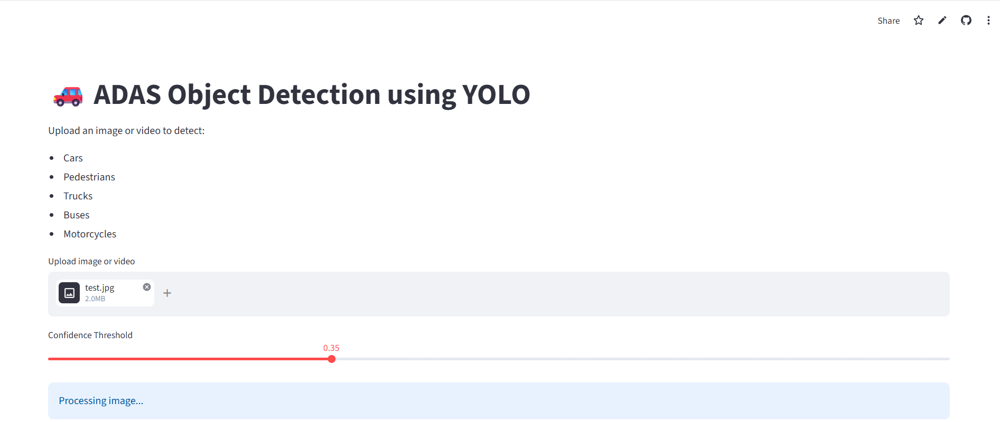
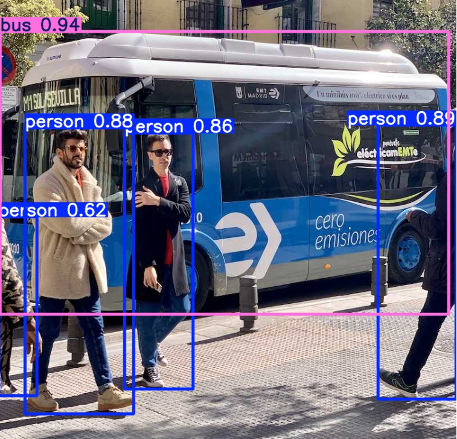

# 🚗 ADAS Object Detection using YOLO

## 📌 Overview

This project is an AI-powered computer vision application for detecting road users and vehicles using YOLO (You Only Look Once) and Streamlit.

The application allows users to upload images or videos and automatically detects:

* Cars
* Pedestrians
* Trucks
* Buses
* Motorcycles

The processed output can then be downloaded directly from the application.

---

## 🚀 Features

* Real-time object detection using YOLO
* Image detection support
* Video detection support
* Download processed videos
* Interactive Streamlit web interface
* Adjustable confidence threshold

---

## 🛠️ Technologies Used

* Python
* YOLO (Ultralytics)
* Streamlit
* OpenCV
* NumPy

---

## 📂 Project Structure

```text
ADAS-YOLO-DETECTION/
│
├── app.py
├── requirements.txt
└── README.md
```

---

## ▶️ Installation

Clone the repository:

```bash
git clone https://github.com/your-username/ADAS-YOLO-DETECTION.git
cd ADAS-YOLO-DETECTION
```

Install dependencies:

```bash
pip install -r requirements.txt
```

Run the application:

```bash
streamlit run app.py
```

---

## 📸 Application Workflow

1. Upload an image or video
2. Select confidence threshold
3. Run YOLO object detection
4. View or download the processed result

---

## 🎯 Use Cases

* ADAS perception systems
* Vehicle and pedestrian detection
* Computer vision learning projects
* AI deployment demonstrations
* Smart mobility applications

---

## 🌐 Deployment

The application can be deployed using:

* Streamlit Community Cloud
* Render
* Hugging Face Spaces

---
## 📸 Screenshots

### Application Interface


### Detection Result

## 👩‍💻 Author

Fatima Zahra EL OUARDI

Functional & Safety Engineer | AI & Computer Vision Enthusiast
